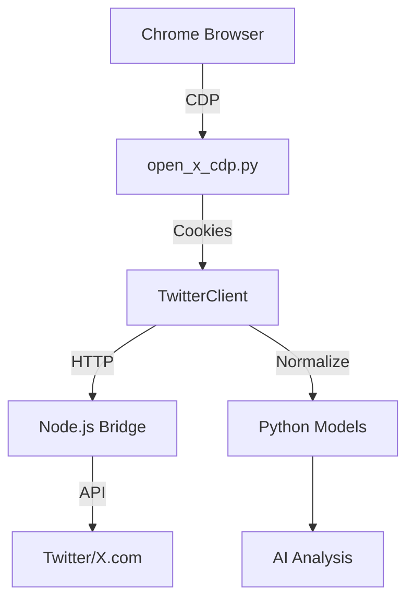

# AI Twitter Algorithm Analyzer

A comprehensive system for analyzing Twitter data using AI algorithms, built with Python and TypeScript.

## Features

### Python Twitter Client (`twitter_client.py`)
- **Cookie Authentication**: Secure authentication using cookies extracted via Chrome DevTools Protocol
- **HTTP Bridge Communication**: Seamless integration with Node.js bridge for API access
- **Data Model Integration**: Automatic normalization to structured Python data models
- **Comprehensive Error Handling**: Robust error handling with exponential backoff retry logic
- **Functional Methods**: Support for timeline retrieval, tweet fetching, and tweet analysis
- **TDD Development**: Developed using Test-Driven Development with 100% test coverage

### Core Components
- **Cookie Extraction** (`open_x_cdp.py`): Chrome DevTools Protocol integration for secure authentication
- **Data Models** (`models.py`): Comprehensive data structures for tweets, profiles, and engagement metrics  
- **Configuration Management** (`config.py`): Flexible configuration system with environment variable support
- **Node.js Bridge** (`twitter_bridge/`): Express.js API bridge for Twitter integration

### Test Coverage
- **111 Total Tests**: Comprehensive test suite covering all functionality
- **37 TwitterClient Tests**: Full TDD test coverage for the Python client
- **74 Core Tests**: Extensive testing for models, configuration, and utilities
- **Mock Integration**: Isolated unit tests with proper mocking

## Architecture



## Installation

1. **Clone the repository:**
   ```bash
   git clone https://github.com/osbornesec/twitter-algo-analyzer.git
   cd twitter-algo-analyzer
   ```

2. **Set up Python environment:**
   ```bash
   python -m venv venv
   source venv/bin/activate  # On Windows: venv\Scripts\activate
   pip install -r requirements.txt
   ```

3. **Set up Node.js bridge:**
   ```bash
   cd twitter_bridge
   npm install
   cd ..
   ```

## Usage

### Extract Authentication Cookies
```bash
python open_x_cdp.py
```

### Use Python Twitter Client
```python
import json
from twitter_client import TwitterClient

# Load cookies
with open('cookies.json', 'r') as f:
    cookies = json.load(f)

# Initialize client
client = TwitterClient()
client.load_cookies(cookies)

# Get timeline
tweets = client.get_timeline(count=20)
print(f"Retrieved {len(tweets)} tweets")

# Get specific tweet
tweet = client.get_tweet('1234567890123456789')
print(f"Tweet: {tweet.text}")
print(f"Engagement: {tweet.engagement.likes} likes, {tweet.engagement.retweets} retweets")
```

## Development

### Running Tests
```bash
# Run all tests
python -m pytest

# Run with coverage
python -m pytest --cov=. --cov-report=html

# Run specific test file
python -m pytest tests/test_twitter_client.py -v
```

### Code Quality
```bash
# Format code
black .

# Lint code  
ruff check .

# Type checking
mypy .
```

## Project Structure

```
├── twitter_client.py          # Main Python Twitter client
├── open_x_cdp.py             # Chrome DevTools Protocol integration
├── models.py                 # Data models for tweets and profiles
├── config.py                 # Configuration management
├── demo.py                   # Example usage
├── tests/                    # Test suite
│   ├── test_twitter_client.py
│   ├── test_models.py  
│   ├── test_config.py
│   └── fixtures/            # Test fixtures and mock data
├── twitter_bridge/          # Node.js Express API bridge
└── requirements.txt         # Python dependencies
```

## Development Methodology

This project was built using **canonical Test-Driven Development (TDD)**:

1. **Red Phase**: Wrote 37 comprehensive failing tests defining expected behavior
2. **Green Phase**: Implemented minimal code to make all tests pass  
3. **Refactor Phase**: Cleaned up code while maintaining test coverage

**Result**: 111/111 tests passing with comprehensive coverage of all functionality.

## Contributing

1. Fork the repository
2. Create a feature branch (`git checkout -b feature/amazing-feature`)
3. Write tests first (TDD approach)
4. Implement the feature
5. Ensure all tests pass (`python -m pytest`)
6. Commit your changes (`git commit -m 'Add amazing feature'`)
7. Push to the branch (`git push origin feature/amazing-feature`)
8. Open a Pull Request

## License

This project is licensed under the MIT License - see the [LICENSE](LICENSE) file for details.

## Dependencies

### Python
- `requests`: HTTP client for API communication
- `python-dateutil`: Date parsing utilities
- `pytest`: Testing framework
- `black`: Code formatting
- `ruff`: Code linting

### Node.js
- `express`: Web framework for API bridge
- `cors`: Cross-origin resource sharing
- `helmet`: Security middleware

## Roadmap

- [ ] Implement search functionality (pending library limitations)
- [ ] Add profile analysis features (pending library limitations)  
- [ ] Integrate AI analysis algorithms
- [ ] Add real-time streaming support
- [ ] Implement caching layer
- [ ] Add web dashboard
- [ ] Docker containerization

## Acknowledgments

- Built with Test-Driven Development methodology
- Chrome DevTools Protocol for secure authentication
- Express.js for API bridge functionality
- Python dataclasses for clean data modeling
